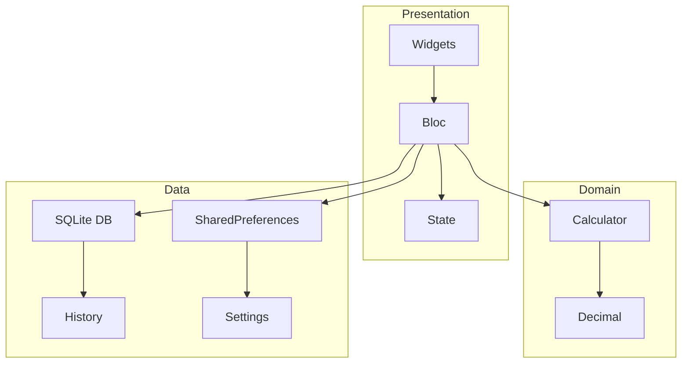

<div align="center">
  <h1>🧮 PrecisionCalc</h1>
  <p><em>A feature-rich, offline-first calculator app for Android built with Flutter.</em></p>
  <p>
    
    
    
    
    
  </p>
  <p>
    <a href="#-features">Features</a> •
    <a href="#-screenshots">Screenshots</a> •
    <a href="#-architecture">Architecture</a> •
    <a href="#-getting-started">Getting Started</a> •
    <a href="#-download">Download</a> •
    <a href="#-contributing">Contributing</a>
  </p>
</div>

---

## ✨ Features

*   **📱 Adaptive UI**: Seamlessly scales from phones to tablets using a custom responsive system.
*   **🧠 Scientific Calculator**: Advanced functions including trigonometry (`sin`, `cos`, `tan`), logarithms (`log`, `ln`), square root (`√`), powers (`x²`, `x³`, `xʸ`), factorial (`n!`), and constants (`π`, `e`).
*   **💾 Memory Operations**: Store and recall values using standard `MC`, `MR`, `M+`, `M-`, and `MS` buttons.
*   **↩️ Undo/Redo**: Full undo/redo stack to correct mistakes instantly.
*   **📜 Calculation History**: Persistent history stored in a local SQLite database for quick recall.
*   **🌍 Multi‑Language**: Full support for **English** and **Arabic**, including RTL layout.
*   **🌙 Dark/Light Themes**: Choose between light, dark, or system default themes.
*   **🔊 Optional Haptics & Sound**: Tactile feedback and audio cues enhance the user experience (can be toggled in Settings).
*   **⚡ High Precision**: Built with the `decimal` package for accurate calculations, avoiding floating‑point errors.
*   **🚀 Performance Optimized**: Uses `flutter_bloc` for efficient state management and lazy loading for scientific panels.

---

## 📸 Screenshots

<div align="center">
  
  
  
</div>

---

## 🏗️ Architecture

PrecisionCalc follows **Clean Architecture** principles with a clear separation of concerns:



*   **State Management**: `flutter_bloc` for predictable state transitions.
*   **Persistence**: `sqflite` for calculation history, `shared_preferences` for user settings.
*   **Precision**: `decimal` package to avoid floating‑point inaccuracies.
*   **Responsiveness**: Custom `Responsive` utility class for dynamic sizing.

---

## 🚀 Getting Started

### Prerequisites

*   Flutter SDK `>=3.27.0`
*   Dart `>=3.7.0`
*   Android Studio / VS Code with Flutter extensions

### Installation

1.  **Clone the repository**
    ```bash
    git clone https://github.com/YOUR_USERNAME/PrecisionCalc.git
    cd PrecisionCalc
    ```

2.  **Get dependencies**
    ```bash
    flutter pub get
    ```

3.  **Run the app**
    ```bash
    flutter run
    ```

> **Note on Sound Assets**: The app is designed to run without sound files. To enable optional sound effects, place `.wav` files in `assets/sounds/` and toggle the feature in Settings.

---

## 📥 Download

| Platform | Link |
|---|---|
| Android APK | [Download Latest Release](https://github.com/lelextb/PrecisionCalc/releases/latest) |

---

## 🤝 Contributing

We welcome contributions! Please see [CONTRIBUTING.md](CONTRIBUTING.md) for guidelines on how to submit pull requests, report issues, or request features.

---

## 📄 License

This project is licensed under the MIT License - see the [LICENSE](LICENSE) file for details.

---

<div align="center">
  <p>Made with ❤️ by LelexTB</p>
  <p>
    <a href="https://github.com/lelextb">GitHub</a> •
  </p>
</div>
